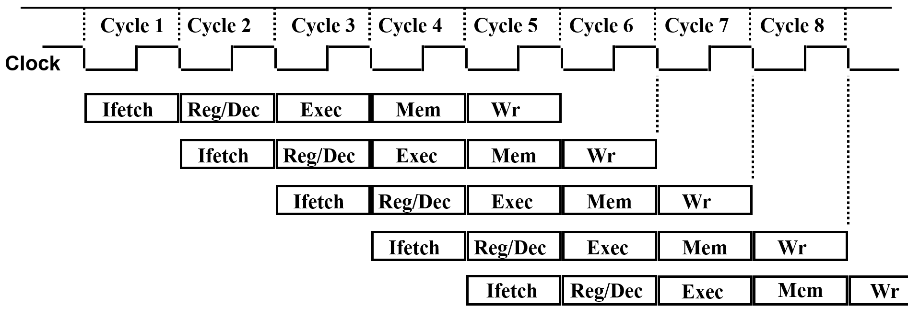

- 五级流水线
  - 取指 (Ifetch) - pipe_stage_fetch
  - 译码 (Reg/Dec) - pipe_stage_decode
  - 执行 (Exec) - pipe_stage_execute
  - 访存 (Mem) - pipe_stage_mem
  - 写回 (Wb) - pipe_stage_wb

- 流水线为何倒着写？

    实现指令重叠执行，同时解决冒险。
    
    
    
    在每个cycle中，先运行前面指令的流水线阶段。
    每个阶段运行时会判断当前阶段是否可运行，即是否有非零op，其op来自于上一cycle的同指令的上游阶段。上游阶段运行完成时，将op传给下游阶段，下游阶段在下一cycle运行。实际上相当于通过转发(Forwarding)解决数据冒险。
    
    对于Load-use冒险，由于是先执行前面的指令，后执行后面的指令，自动解决了冒险。

    也就是说，在每个cycle中，每个阶段运行的op不属于同一指令，其对应指令的输入时间按 wb-me-ex-de-if 的顺序递增。

- 为何在excute、decode阶段判断下游阶段是否阻塞

    excute阻塞来源于乘除法阻塞或上一指令的mem阻塞，decode与其存在数据冒险，因此应空一个周期等待下游阶段(即上一指令的excute)完成，同时保留输入，即转发的op。
    
    在实验中应实现mem阻塞，cache miss时触发，excute对应空一个周期并保留op。

